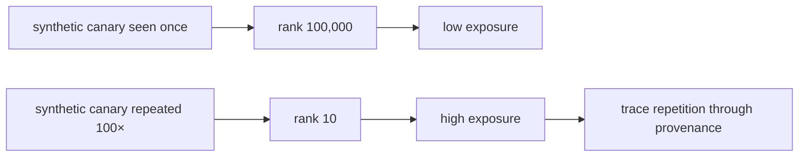

# Diagram — A Memorization Audit — Did the Model Learn a Pattern or Store a Passage?


```mermaid
flowchart LR
  C1["synthetic canary seen once"] --> R1["rank 100,000"] --> E1["low exposure"]
  C2["synthetic canary repeated 100×"] --> R2["rank 10"] --> E2["high exposure"]
  E2 --> P["trace repetition through provenance"]
```

```text
known synthetic secret -> measured rank -> authorized extraction audit
```
