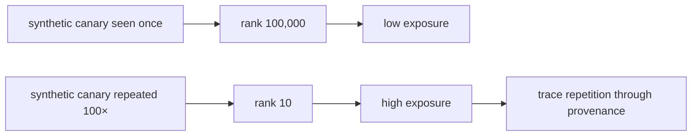

# Diagram — A Memorization Audit — Did the Model Learn a Pattern or Store a Passage?



```text
known synthetic secret -> measured rank -> authorized extraction audit
```

<!-- memory-film-v1:start -->
## Five-frame memory film

```text
QUESTION       What fails if we ask the model whether it remembers private text and trust its answer?
     ↓
OBJECT         the memorization audit thread mounted on the chain-of-custody ledger
     ↓
VISIBLE BREAK  The thread follows the tempting path—ask the model whether it remembers private text and trust its answer. Then the evidence answers: a model has no reliable introspective inventory of its training examples, and ordinary prompts may miss strings that an adversarial sampling strategy can recover.
     ↓
TRANSFORMATION The archivist-engineer changes one moving part. The thread can now plant consented synthetic canaries, measure their rank among alternatives, test extraction procedures on authorized data, and connect failures back through provenance and duplicate counts.
     ↓
MEMORY SEAL    A Memorization Audit keeps the missing power: plant consented synthetic canaries, measure their rank among alternatives, test extraction procedures on authorized data, and connect failures back through provenance and duplicate counts.
```
<!-- memory-film-v1:end -->
