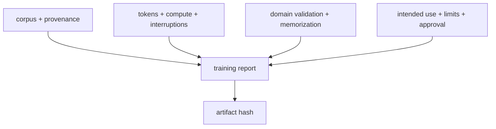

# Diagram — The Training Report — Preserve the Decisions, Not Only the Weights



```text
weights answer prompts; the report answers what produced and bounded them
```

<!-- memory-film-v1:start -->
## Five-frame memory film

```text
QUESTION       What fails if we publish the final benchmark table and assume the configuration files explain the rest?
     ↓
OBJECT         the training report mirror mounted on the chain-of-custody ledger
     ↓
VISIBLE BREAK  The mirror follows the tempting path—publish the final benchmark table and assume the configuration files explain the rest. Then the evidence answers: a score has no visible data lineage, uncertainty, subgroup behavior, energy or hardware context, incident history, or warning about uses the evaluation never tested.
     ↓
TRANSFORMATION The archivist-engineer changes one moving part. The mirror can now generate a training report from manifests and logs, then add human-reviewed explanations of intended use, out-of-scope use, limitations, incidents, provenance, evaluation conditions, and responsible release decisions.
     ↓
MEMORY SEAL    The Training Report keeps the missing power: generate a training report from manifests and logs, then add human-reviewed explanations of intended use, out-of-scope use, limitations, incidents, provenance, evaluation conditions, and responsible release decisions.
```
<!-- memory-film-v1:end -->
