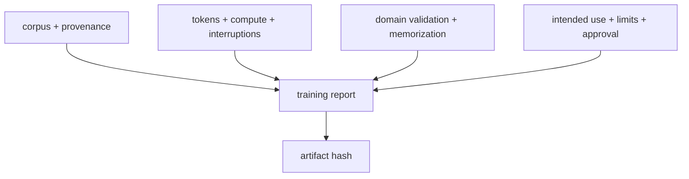

# Diagram — The Training Report — Preserve the Decisions, Not Only the Weights


```mermaid
flowchart TB
  DATA["corpus + provenance"] --> REPORT["training report"]
  RUN["tokens + compute + interruptions"] --> REPORT
  EVAL["domain validation + memorization"] --> REPORT
  GOV["intended use + limits + approval"] --> REPORT
  REPORT --> ART["artifact hash"]
```

```text
weights answer prompts; the report answers what produced and bounded them
```
