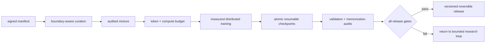

# Diagram — A Tiny Pretraining Factory — Close the Accountable Training Loop


```mermaid
flowchart LR
  M["signed manifest"] --> C["boundary-aware curation"] --> MIX["audited mixture"] --> B["token + compute budget"]
  B --> TRAIN["measured distributed training"] --> CKPT["atomic resumable checkpoints"] --> V["validation + memorization audits"] --> G{"all release gates"}
  G -->|"pass"| R["versioned reversible release"]
  G -->|"fail"| LOOP["return to bounded research loop"]
```

```text
no stage can average away a failed provenance, privacy, recovery, or release gate
```
