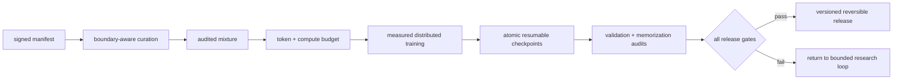

# Diagram — A Tiny Pretraining Factory — Close the Accountable Training Loop



```text
no stage can average away a failed provenance, privacy, recovery, or release gate
```

<!-- memory-film-v1:start -->
## Five-frame memory film

```text
QUESTION       What fails if we connect every tool into one automatic pipeline and trust any run that reaches the final stage?
     ↓
OBJECT         the tiny pretraining factory bell mounted on the chain-of-custody ledger
     ↓
VISIBLE BREAK  The bell follows the tempting path—connect every tool into one automatic pipeline and trust any run that reaches the final stage. Then the evidence answers: automation can faithfully repeat a wrong manifest, destructive filter, contaminated validation set, incomplete checkpoint, or unauthorized release. Completion is not evidence of correctness.
     ↓
TRANSFORMATION The archivist-engineer changes one moving part. The bell can now assemble signed stage manifests, boundary-aware curation, audited mixtures, fixed budgets, measured schedules, distributed equivalence tests, atomic checkpoints, live validation, memorization probes, and human release gates into one reversible factory.
     ↓
MEMORY SEAL    A Tiny Pretraining Factory keeps the missing power: assemble signed stage manifests, boundary-aware curation, audited mixtures, fixed budgets, measured schedules, distributed equivalence tests, atomic checkpoints, live validation, memorization probes, and human release gates into one reversible factory.
```
<!-- memory-film-v1:end -->
