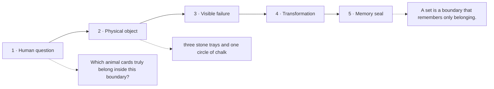

# Diagram — Excavation 201: Sets — Drawing a Boundary Around ‘Belongs’

## The five-frame memory film



```text
FRAME 1 — QUESTION
Which animal cards truly belong inside this boundary?

FRAME 2 — OBJECT
three stone trays and one circle of chalk

FRAME 3 — FAILURE
The tiger card appears twice, and moving it to the front changes the list although nothing about belonging changed.

FRAME 4 — TRANSFORMATION
Sweep away the numbered positions. Draw one chalk boundary around the admitted cards; let overlap appear where two circles share the same floor.

FRAME 5 — SEAL
A set is a boundary that remembers only belonging.
```

## Position inside the Undercroft

```text
Realm 1 of 5 — The Hall of Boundaries
belonging → connection → dependable transformation
current root: Sets
```

```text
temptation : write each tray as an ordinary list and scan every position whenever membership, overlap, or exclusion is questioned
break      : the same animal can occur twice, order pretends to matter, and asking which animals occupy both trays requires a new hand-written loop every time. The list stores a sequence; the question concerns a boundary.
repair     : treat each tray as a collection whose identity depends on membership rather than order or repetition, then construct overlap by retaining exactly the objects admitted by both boundaries
```

The film can be replayed without the equation. Once it is vivid, the symbols become a compact subtitle for a scene the reader already owns.
