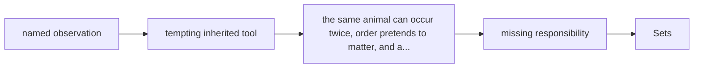

# Diagram — Excavation 201: Sets — Drawing a Boundary Around ‘Belongs’



```text
temptation : write each tray as an ordinary list and scan every position whenever membership, overlap, or exclusion is questioned
break      : the same animal can occur twice, order pretends to matter, and asking which animals occupy both trays requires a new hand-written loop every time. The list stores a sequence; the question concerns a boundary.
repair     : treat each tray as a collection whose identity depends on membership rather than order or repetition, then construct overlap by retaining exactly the objects admitted by both boundaries
```

The diagram is deliberately causal. Its arrows mean “this failure made the next responsibility necessary,” not merely “read this box next.”
