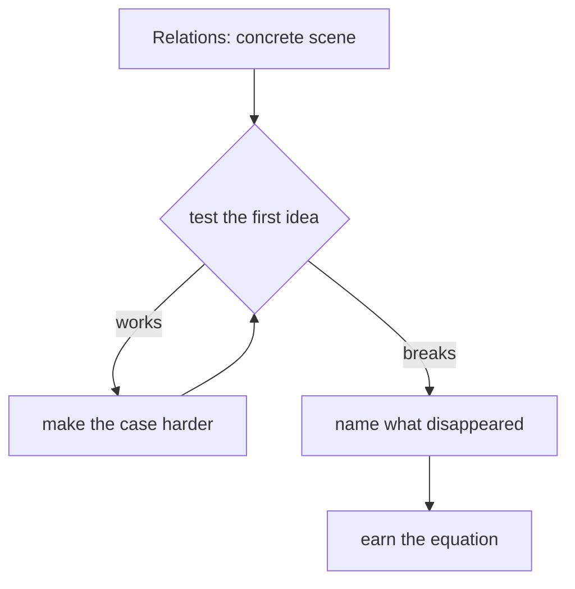

# Diagram — Excavation 202: Relations — When Two Objects Are Connected



```text
temptation : place connected objects in the same set and assume co-membership tells us the nature and direction of their connection
break      : putting tiger, river, and village into one collection cannot distinguish tiger-near-river from village-reports-tiger. It also cannot distinguish an arrow from tiger to river from the reverse arrow.
repair     : store each connection as an ordered pair and let a named relation be the set of all pairs carrying the same kind of edge
```

The diagram is deliberately causal. Its arrows mean “this failure made the next responsibility necessary,” not merely “read this box next.”
