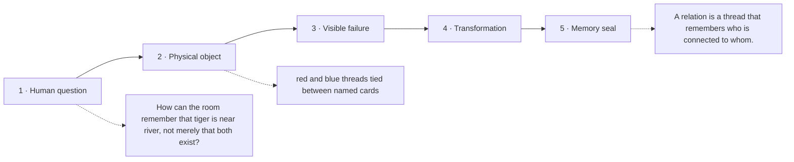

# Diagram — Excavation 202: Relations — When Two Objects Are Connected

## The five-frame memory film



```text
FRAME 1 — QUESTION
How can the room remember that tiger is near river, not merely that both exist?

FRAME 2 — OBJECT
red and blue threads tied between named cards

FRAME 3 — FAILURE
The cards collapse into one heap; the colour and direction of every connection disappear.

FRAME 4 — TRANSFORMATION
Separate the cards and tie an arrowed thread from the first object to the second. Different thread colours preserve different kinds of connection.

FRAME 5 — SEAL
A relation is a thread that remembers who is connected to whom.
```

## Position inside the Undercroft

```text
Realm 1 of 5 — The Hall of Boundaries
belonging → connection → dependable transformation
current root: Relations
```

```text
temptation : place connected objects in the same set and assume co-membership tells us the nature and direction of their connection
break      : putting tiger, river, and village into one collection cannot distinguish tiger-near-river from village-reports-tiger. It also cannot distinguish an arrow from tiger to river from the reverse arrow.
repair     : store each connection as an ordered pair and let a named relation be the set of all pairs carrying the same kind of edge
```

The film can be replayed without the equation. Once it is vivid, the symbols become a compact subtitle for a scene the reader already owns.
