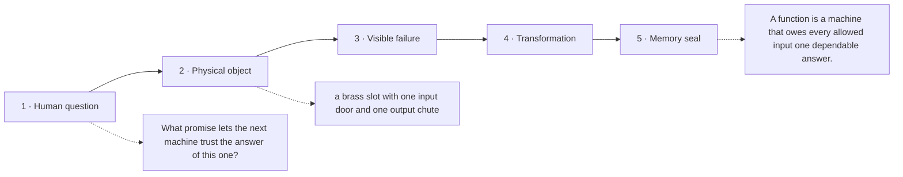

# Diagram — Excavation 203: Functions — A Reusable Promise from Input to Output

## The five-frame memory film



```text
FRAME 1 — QUESTION
What promise lets the next machine trust the answer of this one?

FRAME 2 — OBJECT
a brass slot with one input door and one output chute

FRAME 3 — FAILURE
The same tiger card enters twice and the machine splits, returning two incompatible weights.

FRAME 4 — TRANSFORMATION
Lock one internal track from every allowed input to exactly one output. Other inputs may meet there, but one input can no longer fork.

FRAME 5 — SEAL
A function is a machine that owes every allowed input one dependable answer.
```

## Position inside the Undercroft

```text
Realm 1 of 5 — The Hall of Boundaries
belonging → connection → dependable transformation
current root: Functions
```

```text
temptation : keep any relation between inputs and outputs, then choose one of the available outputs whenever the procedure runs
break      : the relation may omit an input entirely or attach several outputs to it. A reusable procedure cannot promise what it will do, and composition breaks because the next machine may receive nothing or an arbitrary value.
repair     : require every allowed input to point to exactly one output, while permitting different inputs to share the same output
```

The film can be replayed without the equation. Once it is vivid, the symbols become a compact subtitle for a scene the reader already owns.
