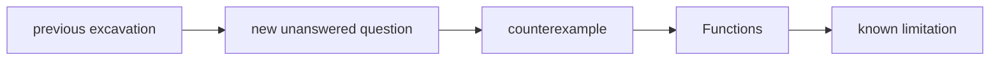

# Diagram — Excavation 203: Functions — A Reusable Promise from Input to Output



```text
temptation : keep any relation between inputs and outputs, then choose one of the available outputs whenever the procedure runs
break      : the relation may omit an input entirely or attach several outputs to it. A reusable procedure cannot promise what it will do, and composition breaks because the next machine may receive nothing or an arbitrary value.
repair     : require every allowed input to point to exactly one output, while permitting different inputs to share the same output
```

The diagram is deliberately causal. Its arrows mean “this failure made the next responsibility necessary,” not merely “read this box next.”
