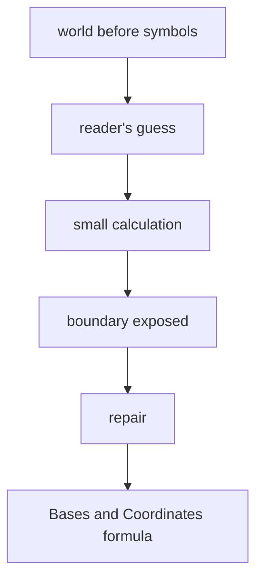

# Diagram — Excavation 204: Bases and Coordinates — The Same Object in Another Language



```text
temptation : treat the coordinate list as the vector itself and conclude that changing the list changes the underlying displacement
break      : the east-north list `[3,2]` and its diagonal-coordinate list disagree numerically even though both return the ranger to the same physical endpoint. Coordinates depend on the chosen measuring directions.
repair     : choose a set of basis directions and define coordinates as the amounts of those directions whose combination reconstructs the vector
```

The diagram is deliberately causal. Its arrows mean “this failure made the next responsibility necessary,” not merely “read this box next.”
