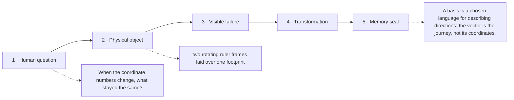

# Diagram — Excavation 204: Bases and Coordinates — The Same Object in Another Language

## The five-frame memory film



```text
FRAME 1 — QUESTION
When the coordinate numbers change, what stayed the same?

FRAME 2 — OBJECT
two rotating ruler frames laid over one footprint

FRAME 3 — FAILURE
The walk receives two different number pairs, and the record falsely declares that the ranger took two different journeys.

FRAME 4 — TRANSFORMATION
Keep the footprint fixed while rotating the rulers beneath it. Rebuild the same endpoint from new amounts of the new directions.

FRAME 5 — SEAL
A basis is a chosen language for describing directions; the vector is the journey, not its coordinates.
```

## Position inside the Undercroft

```text
Realm 2 of 5 — The Chamber of Directions
language of space → new directions → persistent directions → honest shadows → strongest channels
current root: Bases and Coordinates
```

```text
temptation : treat the coordinate list as the vector itself and conclude that changing the list changes the underlying displacement
break      : the east-north list `[3,2]` and its diagonal-coordinate list disagree numerically even though both return the ranger to the same physical endpoint. Coordinates depend on the chosen measuring directions.
repair     : choose a set of basis directions and define coordinates as the amounts of those directions whose combination reconstructs the vector
```

The film can be replayed without the equation. Once it is vivid, the symbols become a compact subtitle for a scene the reader already owns.
