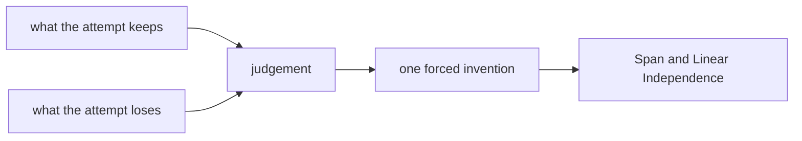

# Diagram — Excavation 205: Span and Linear Independence — Which Directions Are Truly New?



```text
temptation : count every stored direction as a new dimension and assign each one an independent coordinate
break      : northeast equals east plus north, so the same displacement receives many coefficient lists. The coordinate system can no longer tell which explanation is unique, and parameter count exaggerates true capacity.
repair     : call the reachable collection of combinations the span, and call directions independent only when no nontrivial weighted combination collapses to zero
```

The diagram is deliberately causal. Its arrows mean “this failure made the next responsibility necessary,” not merely “read this box next.”
