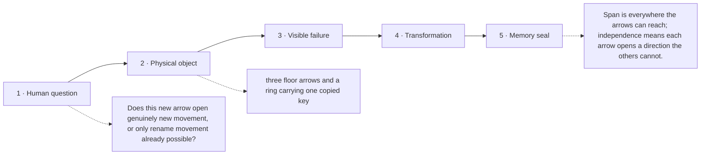

# Diagram — Excavation 205: Span and Linear Independence — Which Directions Are Truly New?

## The five-frame memory film



```text
FRAME 1 — QUESTION
Does this new arrow open genuinely new movement, or only rename movement already possible?

FRAME 2 — OBJECT
three floor arrows and a ring carrying one copied key

FRAME 3 — FAILURE
The northeast arrow boasts of a third dimension even though east plus north already draws it exactly.

FRAME 4 — TRANSFORMATION
Try to cancel the arrows back to no movement. The nonzero recipe that succeeds exposes the copied direction; remove it and the reachable floor does not shrink.

FRAME 5 — SEAL
Span is everywhere the arrows can reach; independence means each arrow opens a direction the others cannot.
```

## Position inside the Undercroft

```text
Realm 2 of 5 — The Chamber of Directions
language of space → new directions → persistent directions → honest shadows → strongest channels
current root: Span and Linear Independence
```

```text
temptation : count every stored direction as a new dimension and assign each one an independent coordinate
break      : northeast equals east plus north, so the same displacement receives many coefficient lists. The coordinate system can no longer tell which explanation is unique, and parameter count exaggerates true capacity.
repair     : call the reachable collection of combinations the span, and call directions independent only when no nontrivial weighted combination collapses to zero
```

The film can be replayed without the equation. Once it is vivid, the symbols become a compact subtitle for a scene the reader already owns.
