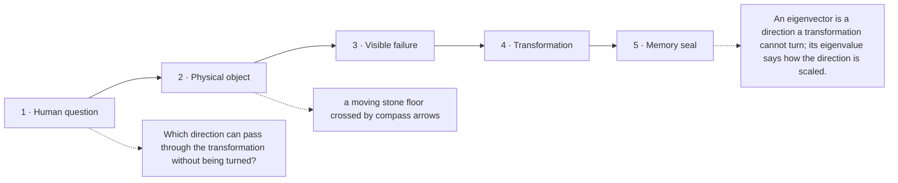

# Diagram — Excavation 206: Eigenvectors and Eigenvalues — Directions a Transformation Cannot Turn

## The five-frame memory film



```text
FRAME 1 — QUESTION
Which direction can pass through the transformation without being turned?

FRAME 2 — OBJECT
a moving stone floor crossed by compass arrows

FRAME 3 — FAILURE
Most arrows tumble differently at every repetition, burying the long-term pattern beneath changing coordinates.

FRAME 4 — TRANSFORMATION
Place arrows one by one until an eastward arrow emerges still pointing east—only longer. Mark that quiet direction and the scale impressed upon it.

FRAME 5 — SEAL
An eigenvector is a direction a transformation cannot turn; its eigenvalue says how the direction is scaled.
```

## Position inside the Undercroft

```text
Realm 2 of 5 — The Chamber of Directions
language of space → new directions → persistent directions → honest shadows → strongest channels
current root: Eigenvectors and Eigenvalues
```

```text
temptation : track every coordinate of every repeatedly transformed arrow and hope the long-term pattern becomes obvious
break      : coordinate expressions grow while the persistent behavior stays hidden. Two initial arrows can look unrelated even when repeated transformation eventually makes both align with the same dominant direction.
repair     : search for nonzero directions that the transformation only scales, and record the corresponding scale factors
```

The film can be replayed without the equation. Once it is vivid, the symbols become a compact subtitle for a scene the reader already owns.
