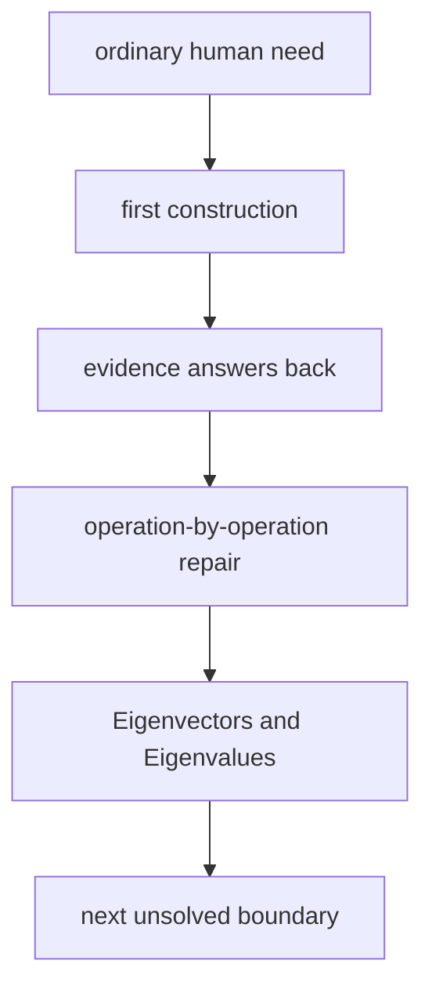

# Diagram — Excavation 206: Eigenvectors and Eigenvalues — Directions a Transformation Cannot Turn



```text
temptation : track every coordinate of every repeatedly transformed arrow and hope the long-term pattern becomes obvious
break      : coordinate expressions grow while the persistent behavior stays hidden. Two initial arrows can look unrelated even when repeated transformation eventually makes both align with the same dominant direction.
repair     : search for nonzero directions that the transformation only scales, and record the corresponding scale factors
```

The diagram is deliberately causal. Its arrows mean “this failure made the next responsibility necessary,” not merely “read this box next.”
