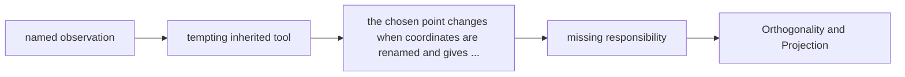

# Diagram — Excavation 207: Orthogonality and Projection — Finding the Closest Shadow



```text
temptation : copy whichever coordinate looks largest or slide to an arbitrary point on the allowed rail
break      : the chosen point changes when coordinates are renamed and gives no proof that another allowed point is not closer. The discarded error may still point partly along the rail, revealing that more of the track could have been retained.
repair     : choose the shadow whose leftover error is perpendicular to the allowed direction, because then no further movement along the rail can reduce the distance
```

The diagram is deliberately causal. Its arrows mean “this failure made the next responsibility necessary,” not merely “read this box next.”
