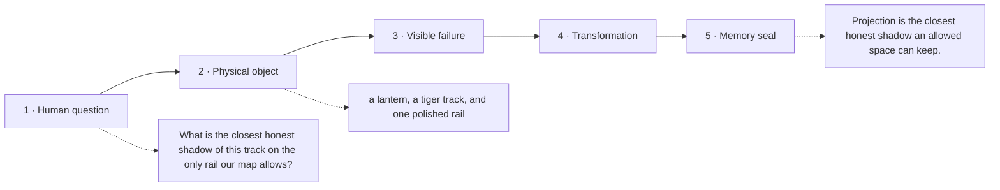

# Diagram — Excavation 207: Orthogonality and Projection — Finding the Closest Shadow

## The five-frame memory film



```text
FRAME 1 — QUESTION
What is the closest honest shadow of this track on the only rail our map allows?

FRAME 2 — OBJECT
a lantern, a tiger track, and one polished rail

FRAME 3 — FAILURE
An arbitrary shadow leaves an error that still runs partly along the rail, proving that some allowed information was unnecessarily discarded.

FRAME 4 — TRANSFORMATION
Slide the shadow until the leftover error stands exactly perpendicular to the rail. No further allowed slide can make the disagreement smaller.

FRAME 5 — SEAL
Projection is the closest honest shadow an allowed space can keep.
```

## Position inside the Undercroft

```text
Realm 2 of 5 — The Chamber of Directions
language of space → new directions → persistent directions → honest shadows → strongest channels
current root: Orthogonality and Projection
```

```text
temptation : copy whichever coordinate looks largest or slide to an arbitrary point on the allowed rail
break      : the chosen point changes when coordinates are renamed and gives no proof that another allowed point is not closer. The discarded error may still point partly along the rail, revealing that more of the track could have been retained.
repair     : choose the shadow whose leftover error is perpendicular to the allowed direction, because then no further movement along the rail can reduce the distance
```

The film can be replayed without the equation. Once it is vivid, the symbols become a compact subtitle for a scene the reader already owns.
