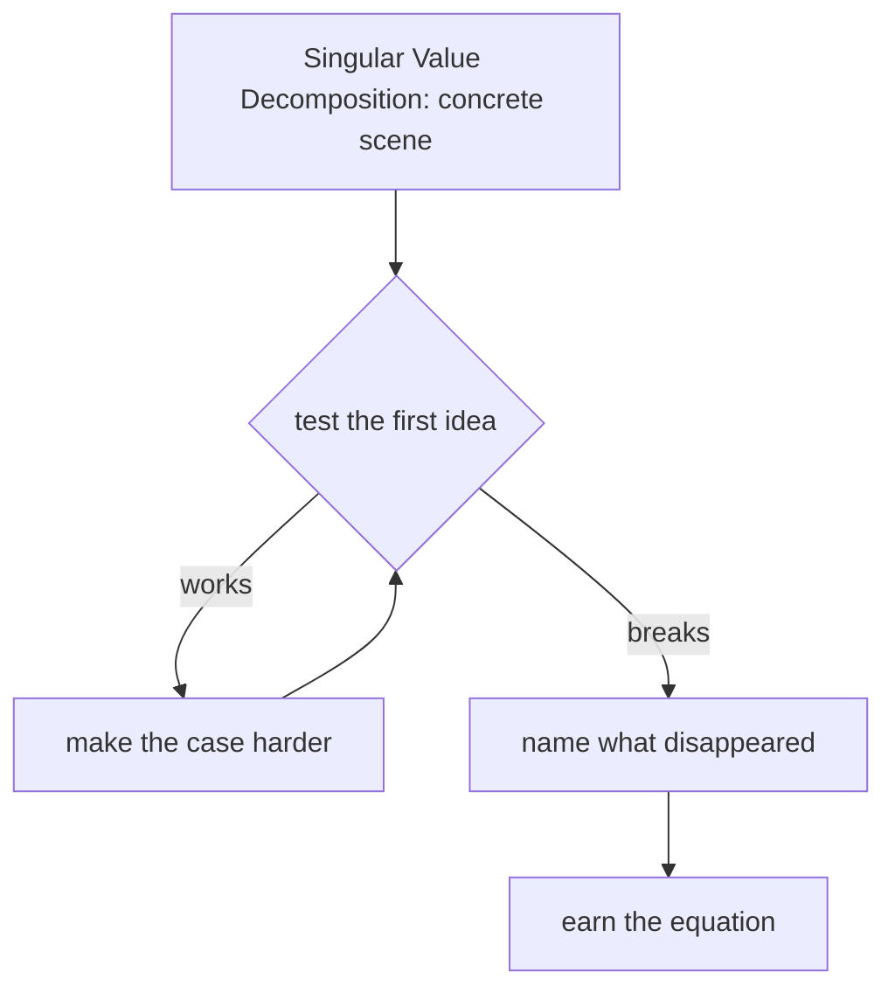

# Diagram — Excavation 208: Singular Value Decomposition — The Important Directions of Any Matrix



```text
temptation : keep the largest individual matrix entries and set the rest to zero
break      : a useful direction may be distributed across many modest entries, while one large entry may contribute little to the matrix's coordinated behavior. Entry size ignores how rows and columns act together.
repair     : rotate the input into orthogonal right-singular directions, scale each by a nonnegative singular value, and rotate into orthogonal output directions; keep the strongest channels for a principled low-rank approximation
```

The diagram is deliberately causal. Its arrows mean “this failure made the next responsibility necessary,” not merely “read this box next.”
