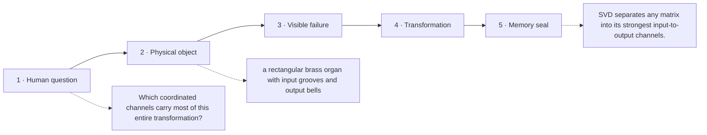

# Diagram — Excavation 208: Singular Value Decomposition — The Important Directions of Any Matrix

## The five-frame memory film



```text
FRAME 1 — QUESTION
Which coordinated channels carry most of this entire transformation?

FRAME 2 — OBJECT
a rectangular brass organ with input grooves and output bells

FRAME 3 — FAILURE
Polishing the largest rivets changes little; the loudest bell is driven by a pattern spread across many modest parts.

FRAME 4 — TRANSFORMATION
Rotate the input wheel until each independent push rings one output direction, then order the bells from strongest to faintest.

FRAME 5 — SEAL
SVD separates any matrix into its strongest input-to-output channels.
```

## Position inside the Undercroft

```text
Realm 2 of 5 — The Chamber of Directions
language of space → new directions → persistent directions → honest shadows → strongest channels
current root: Singular Value Decomposition
```

```text
temptation : keep the largest individual matrix entries and set the rest to zero
break      : a useful direction may be distributed across many modest entries, while one large entry may contribute little to the matrix's coordinated behavior. Entry size ignores how rows and columns act together.
repair     : rotate the input into orthogonal right-singular directions, scale each by a nonnegative singular value, and rotate into orthogonal output directions; keep the strongest channels for a principled low-rank approximation
```

The film can be replayed without the equation. Once it is vivid, the symbols become a compact subtitle for a scene the reader already owns.
