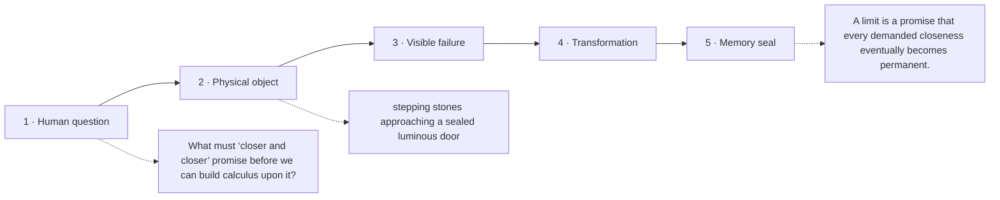

# Diagram — Excavation 209: Limits — Approaching What Cannot Be Reached in One Step

## The five-frame memory film



```text
FRAME 1 — QUESTION
What must ‘closer and closer’ promise before we can build calculus upon it?

FRAME 2 — OBJECT
stepping stones approaching a sealed luminous door

FRAME 3 — FAILURE
The words ‘very close’ move whenever the observer changes standards; no finite final step explains the destination.

FRAME 4 — TRANSFORMATION
Place any tiny ring around the door. Find a stage after which every remaining stone lies inside that ring, however small the ring was chosen.

FRAME 5 — SEAL
A limit is a promise that every demanded closeness eventually becomes permanent.
```

## Position inside the Undercroft

```text
Realm 3 of 5 — The River of Change
approach → local change → coupled change → bending → nearby prediction → accumulation → hidden rhythm
current root: Limits
```

```text
temptation : declare that a sequence reaches its destination only when one finite term equals the destination exactly
break      : the gaps `1/2, 1/4, 1/8, ...` never equal zero, so the rule denies the visible fact that they can be made smaller than any requested tolerance.
repair     : define the destination by a guarantee: however tiny a permitted error is chosen, all sufficiently late terms fall inside it
```

The film can be replayed without the equation. Once it is vivid, the symbols become a compact subtitle for a scene the reader already owns.
