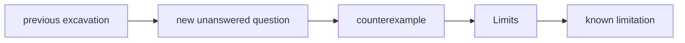

# Diagram — Excavation 209: Limits — Approaching What Cannot Be Reached in One Step



```text
temptation : declare that a sequence reaches its destination only when one finite term equals the destination exactly
break      : the gaps `1/2, 1/4, 1/8, ...` never equal zero, so the rule denies the visible fact that they can be made smaller than any requested tolerance.
repair     : define the destination by a guarantee: however tiny a permitted error is chosen, all sufficiently late terms fall inside it
```

The diagram is deliberately causal. Its arrows mean “this failure made the next responsibility necessary,” not merely “read this box next.”
