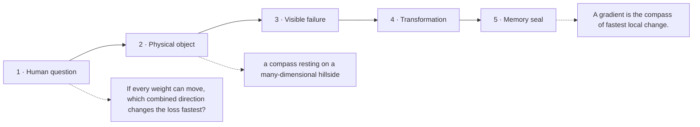

# Diagram — Excavation 210: Partial Derivatives and Gradients — One Landscape, Many Directions

## The five-frame memory film



```text
FRAME 1 — QUESTION
If every weight can move, which combined direction changes the loss fastest?

FRAME 2 — OBJECT
a compass resting on a many-dimensional hillside

FRAME 3 — FAILURE
Separate one-weight trails cover the hill, but they never reveal what happens when several weights move together.

FRAME 4 — TRANSFORMATION
Gather every coordinate slope into one arrow. The compass turns until it points toward the steepest local rise; reverse it to descend.

FRAME 5 — SEAL
A gradient is the compass of fastest local change.
```

## Position inside the Undercroft

```text
Realm 3 of 5 — The River of Change
approach → local change → coupled change → bending → nearby prediction → accumulation → hidden rhythm
current root: Partial Derivatives and Gradients
```

```text
temptation : compute one ordinary derivative as if the entire parameter vector were a single undifferentiated number
break      : the answer cannot say which dial caused which part of the change or which physical direction rises fastest. Different paths through the same point produce different slopes.
repair     : hold every other dial fixed to measure one partial derivative at a time, then gather those coordinate sensitivities into the gradient vector
```

The film can be replayed without the equation. Once it is vivid, the symbols become a compact subtitle for a scene the reader already owns.
