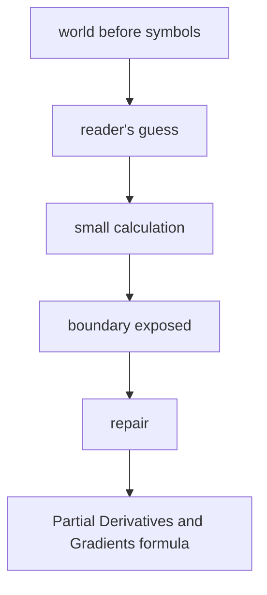

# Diagram — Excavation 210: Partial Derivatives and Gradients — One Landscape, Many Directions



```text
temptation : compute one ordinary derivative as if the entire parameter vector were a single undifferentiated number
break      : the answer cannot say which dial caused which part of the change or which physical direction rises fastest. Different paths through the same point produce different slopes.
repair     : hold every other dial fixed to measure one partial derivative at a time, then gather those coordinate sensitivities into the gradient vector
```

The diagram is deliberately causal. Its arrows mean “this failure made the next responsibility necessary,” not merely “read this box next.”
