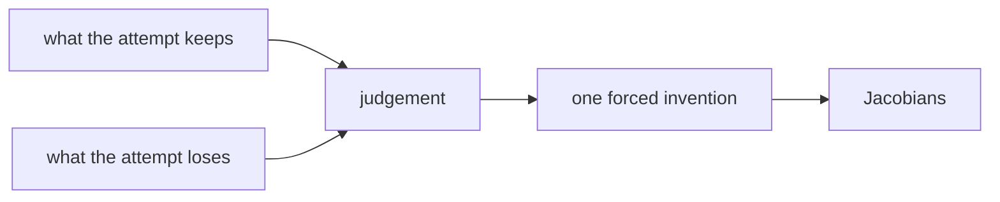

# Diagram — Excavation 211: Jacobians — When Many Outputs Change Together



```text
temptation : differentiate only the first output and reuse that gradient as the sensitivity of the entire transformation
break      : the second output's response disappears. Downstream uncertainty, volume change, and chain-rule propagation become wrong because one row of evidence impersonates the whole map.
repair     : give every output its own gradient row and arrange all output-input sensitivities into one matrix
```

The diagram is deliberately causal. Its arrows mean “this failure made the next responsibility necessary,” not merely “read this box next.”
