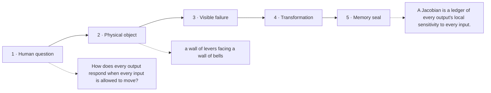

# Diagram — Excavation 211: Jacobians — When Many Outputs Change Together

## The five-frame memory film



```text
FRAME 1 — QUESTION
How does every output respond when every input is allowed to move?

FRAME 2 — OBJECT
a wall of levers facing a wall of bells

FRAME 3 — FAILURE
A single slope follows one lever to one bell while the cross-effects among the rest remain invisible.

FRAME 4 — TRANSFORMATION
Pull each lever slightly and record every bell's response in one rectangular ledger: output rows, input columns.

FRAME 5 — SEAL
A Jacobian is a ledger of every output's local sensitivity to every input.
```

## Position inside the Undercroft

```text
Realm 3 of 5 — The River of Change
approach → local change → coupled change → bending → nearby prediction → accumulation → hidden rhythm
current root: Jacobians
```

```text
temptation : differentiate only the first output and reuse that gradient as the sensitivity of the entire transformation
break      : the second output's response disappears. Downstream uncertainty, volume change, and chain-rule propagation become wrong because one row of evidence impersonates the whole map.
repair     : give every output its own gradient row and arrange all output-input sensitivities into one matrix
```

The film can be replayed without the equation. Once it is vivid, the symbols become a compact subtitle for a scene the reader already owns.
