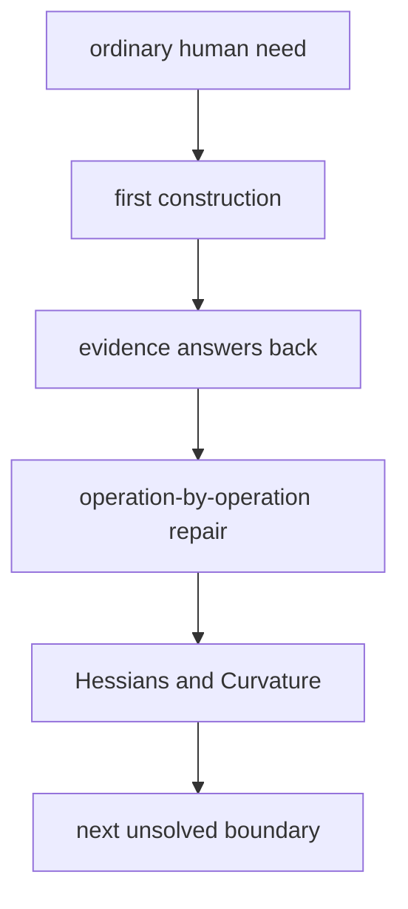

# Diagram — Excavation 212: Hessians and Curvature — Why the Same Slope Can Hide Different Valleys



```text
temptation : declare every zero-gradient point a successful minimum and stop moving
break      : the saddle also has zero first-order slope. Stopping there mistakes balanced opposing curvature for completion, while choosing a large step without curvature can leap across a narrow bowl.
repair     : differentiate the gradient again and store how every pair of coordinates changes the local slope
```

The diagram is deliberately causal. Its arrows mean “this failure made the next responsibility necessary,” not merely “read this box next.”
