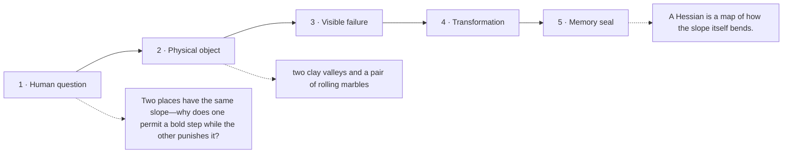

# Diagram — Excavation 212: Hessians and Curvature — Why the Same Slope Can Hide Different Valleys

## The five-frame memory film



```text
FRAME 1 — QUESTION
Two places have the same slope—why does one permit a bold step while the other punishes it?

FRAME 2 — OBJECT
two clay valleys and a pair of rolling marbles

FRAME 3 — FAILURE
Both compasses show the same slope, yet one valley bends gently and the other turns into a narrow wall.

FRAME 4 — TRANSFORMATION
Press a curvature grid into the clay. It records how each component of the gradient changes as every direction moves.

FRAME 5 — SEAL
A Hessian is a map of how the slope itself bends.
```

## Position inside the Undercroft

```text
Realm 3 of 5 — The River of Change
approach → local change → coupled change → bending → nearby prediction → accumulation → hidden rhythm
current root: Hessians and Curvature
```

```text
temptation : declare every zero-gradient point a successful minimum and stop moving
break      : the saddle also has zero first-order slope. Stopping there mistakes balanced opposing curvature for completion, while choosing a large step without curvature can leap across a narrow bowl.
repair     : differentiate the gradient again and store how every pair of coordinates changes the local slope
```

The film can be replayed without the equation. Once it is vivid, the symbols become a compact subtitle for a scene the reader already owns.
