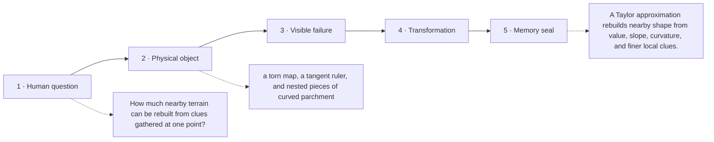

# Diagram — Excavation 213: Taylor Approximation — Borrowing a Function’s Local Shape

## The five-frame memory film



```text
FRAME 1 — QUESTION
How much nearby terrain can be rebuilt from clues gathered at one point?

FRAME 2 — OBJECT
a torn map, a tangent ruler, and nested pieces of curved parchment

FRAME 3 — FAILURE
The straight tangent predicts well for one step, then walks directly away from the bending road.

FRAME 4 — TRANSFORMATION
Begin with the current height, add the slope's straight correction, then add curvature and finer corrections only as distance makes them necessary.

FRAME 5 — SEAL
A Taylor approximation rebuilds nearby shape from value, slope, curvature, and finer local clues.
```

## Position inside the Undercroft

```text
Realm 3 of 5 — The River of Change
approach → local change → coupled change → bending → nearby prediction → accumulation → hidden rhythm
current root: Taylor Approximation
```

```text
temptation : extend the tangent line indefinitely and assume constant slope everywhere
break      : for a curved signal the linear prediction drifts, and doubling h can more than double the error. The tangent remembers direction but forgets that the direction itself changes.
repair     : build a local polynomial: start with the known value, add slope times displacement, then add curvature times squared displacement with the counting factor required by repeated differentiation
```

The film can be replayed without the equation. Once it is vivid, the symbols become a compact subtitle for a scene the reader already owns.
