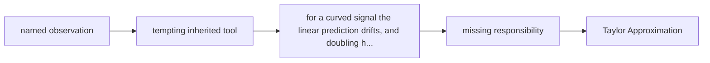

# Diagram — Excavation 213: Taylor Approximation — Borrowing a Function’s Local Shape



```text
temptation : extend the tangent line indefinitely and assume constant slope everywhere
break      : for a curved signal the linear prediction drifts, and doubling h can more than double the error. The tangent remembers direction but forgets that the direction itself changes.
repair     : build a local polynomial: start with the known value, add slope times displacement, then add curvature times squared displacement with the counting factor required by repeated differentiation
```

The diagram is deliberately causal. Its arrows mean “this failure made the next responsibility necessary,” not merely “read this box next.”
