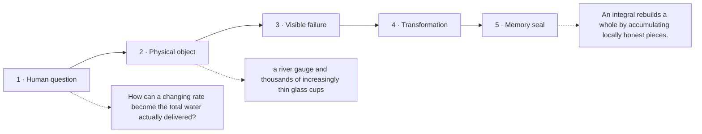

# Diagram — Excavation 214: Integrals — Reconstructing a Whole from Infinitesimal Pieces

## The five-frame memory film



```text
FRAME 1 — QUESTION
How can a changing rate become the total water actually delivered?

FRAME 2 — OBJECT
a river gauge and thousands of increasingly thin glass cups

FRAME 3 — FAILURE
One noon reading is multiplied across the whole day, granting dawn and dusk a rate they never had.

FRAME 4 — TRANSFORMATION
Let each tiny interval fill its own cup at its own rate, add the cups, and make them thinner until coarse partition error disappears.

FRAME 5 — SEAL
An integral rebuilds a whole by accumulating locally honest pieces.
```

## Position inside the Undercroft

```text
Realm 3 of 5 — The River of Change
approach → local change → coupled change → bending → nearby prediction → accumulation → hidden rhythm
current root: Integrals
```

```text
temptation : multiply one chosen rate by the entire duration
break      : the flow is slow at dawn and fast at noon, so one sample grants every moment the wrong rate. Taking more samples helps, but their contributions need a rule that survives as slices become thinner.
repair     : divide time into small intervals, multiply each interval's width by a representative rate, add the resulting little volumes, and take the limit as the widest interval shrinks toward zero
```

The film can be replayed without the equation. Once it is vivid, the symbols become a compact subtitle for a scene the reader already owns.
