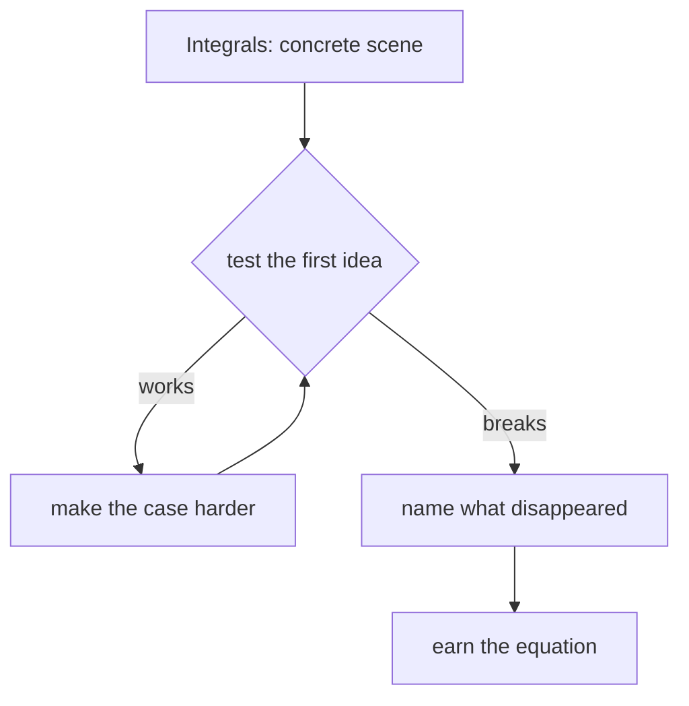

# Diagram — Excavation 214: Integrals — Reconstructing a Whole from Infinitesimal Pieces



```text
temptation : multiply one chosen rate by the entire duration
break      : the flow is slow at dawn and fast at noon, so one sample grants every moment the wrong rate. Taking more samples helps, but their contributions need a rule that survives as slices become thinner.
repair     : divide time into small intervals, multiply each interval's width by a representative rate, add the resulting little volumes, and take the limit as the widest interval shrinks toward zero
```

The diagram is deliberately causal. Its arrows mean “this failure made the next responsibility necessary,” not merely “read this box next.”
