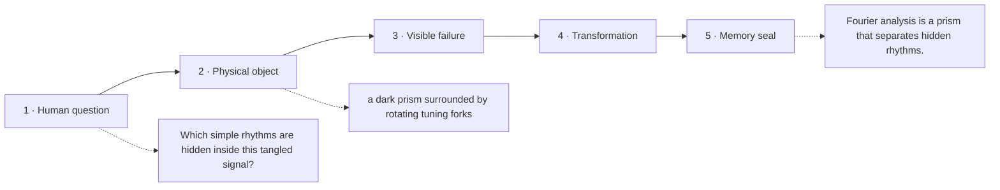

# Diagram — Excavation 215: Fourier Analysis — Hearing Frequencies Hidden Inside Time

## The five-frame memory film



```text
FRAME 1 — QUESTION
Which simple rhythms are hidden inside this tangled signal?

FRAME 2 — OBJECT
a dark prism surrounded by rotating tuning forks

FRAME 3 — FAILURE
The waveform is inspected moment by moment; overlapping notes remain one jagged line.

FRAME 4 — TRANSFORMATION
Turn a candidate rhythm against the signal. Matching rises and falls reinforce across time while mismatched turns cancel.

FRAME 5 — SEAL
Fourier analysis is a prism that separates hidden rhythms.
```

## Position inside the Undercroft

```text
Realm 3 of 5 — The River of Change
approach → local change → coupled change → bending → nearby prediction → accumulation → hidden rhythm
current root: Fourier Analysis
```

```text
temptation : compare waveforms only sample by sample in time
break      : the same note shifted slightly appears very different at every position, and two overlapping tones hide inside one jagged trace. Time coordinates expose when, not which frequency.
repair     : compare the signal with a family of rotating sine-and-cosine patterns and add the agreements, producing one coefficient for each candidate frequency
```

The film can be replayed without the equation. Once it is vivid, the symbols become a compact subtitle for a scene the reader already owns.
