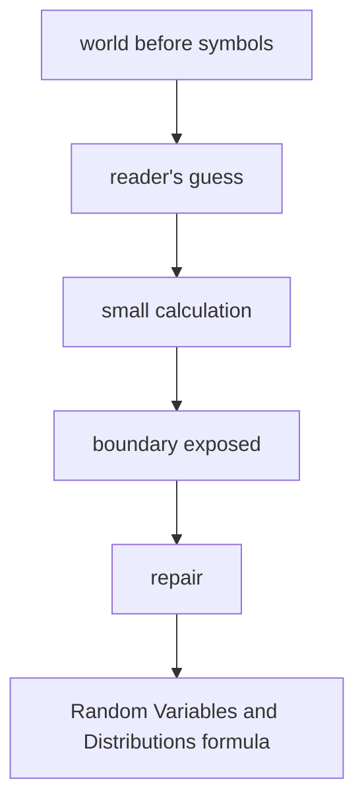

# Diagram — Excavation 216: Random Variables and Distributions — Turning Outcomes into Quantities



```text
temptation : treat the outcome label itself as a number and perform arithmetic directly on names such as ‘no sighting’ and ‘two sightings’
break      : outcomes may be stories, images, or paths rather than numbers, and the same numerical question can group many different outcomes. Arithmetic needs a mapping from possible worlds to values.
repair     : define a random variable as a function assigning a numerical value to every outcome, then transfer probability mass through that mapping to form its distribution
```

The diagram is deliberately causal. Its arrows mean “this failure made the next responsibility necessary,” not merely “read this box next.”
