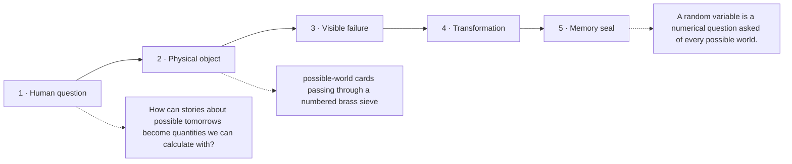

# Diagram — Excavation 216: Random Variables and Distributions — Turning Outcomes into Quantities

## The five-frame memory film



```text
FRAME 1 — QUESTION
How can stories about possible tomorrows become quantities we can calculate with?

FRAME 2 — OBJECT
possible-world cards passing through a numbered brass sieve

FRAME 3 — FAILURE
Names such as ‘empty photograph’ and ‘two tigers’ are added as though stories were already numbers.

FRAME 4 — TRANSFORMATION
Ask one numerical question of every world. Let different stories fall into the same numbered bowl when they give the same answer.

FRAME 5 — SEAL
A random variable is a numerical question asked of every possible world.
```

## Position inside the Undercroft

```text
Realm 4 of 5 — The Observatory of Possible Worlds
possible worlds → evidence → centre and spread → settling averages → bell-shaped error → convincing claims
current root: Random Variables and Distributions
```

```text
temptation : treat the outcome label itself as a number and perform arithmetic directly on names such as ‘no sighting’ and ‘two sightings’
break      : outcomes may be stories, images, or paths rather than numbers, and the same numerical question can group many different outcomes. Arithmetic needs a mapping from possible worlds to values.
repair     : define a random variable as a function assigning a numerical value to every outcome, then transfer probability mass through that mapping to form its distribution
```

The film can be replayed without the equation. Once it is vivid, the symbols become a compact subtitle for a scene the reader already owns.
