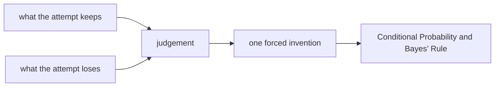

# Diagram — Excavation 217: Conditional Probability and Bayes’ Rule — Let Evidence Rearrange Belief



```text
temptation : compare only how well each animal explains the print and choose the largest likelihood
break      : likelihood ignores how common each animal was before the evidence. A moderately diagnostic clue could make an extremely rare story look certain if prior plausibility is discarded.
repair     : multiply each prior belief by that story's support for the evidence, then divide by the total support across all stories so the surviving weights again form one distribution
```

The diagram is deliberately causal. Its arrows mean “this failure made the next responsibility necessary,” not merely “read this box next.”
