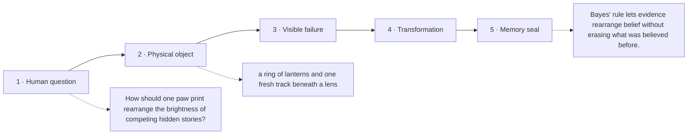

# Diagram — Excavation 217: Conditional Probability and Bayes’ Rule — Let Evidence Rearrange Belief

## The five-frame memory film



```text
FRAME 1 — QUESTION
How should one paw print rearrange the brightness of competing hidden stories?

FRAME 2 — OBJECT
a ring of lanterns and one fresh track beneath a lens

FRAME 3 — FAILURE
The brightest explanation of the print wins even if it was almost impossible before the print appeared.

FRAME 4 — TRANSFORMATION
Begin with each lantern's old brightness, scale it by how naturally that world makes the track, then renormalize the surviving light.

FRAME 5 — SEAL
Bayes' rule lets evidence rearrange belief without erasing what was believed before.
```

## Position inside the Undercroft

```text
Realm 4 of 5 — The Observatory of Possible Worlds
possible worlds → evidence → centre and spread → settling averages → bell-shaped error → convincing claims
current root: Conditional Probability and Bayes’ Rule
```

```text
temptation : compare only how well each animal explains the print and choose the largest likelihood
break      : likelihood ignores how common each animal was before the evidence. A moderately diagnostic clue could make an extremely rare story look certain if prior plausibility is discarded.
repair     : multiply each prior belief by that story's support for the evidence, then divide by the total support across all stories so the surviving weights again form one distribution
```

The film can be replayed without the equation. Once it is vivid, the symbols become a compact subtitle for a scene the reader already owns.
