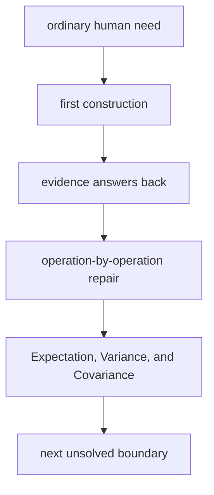

# Diagram — Excavation 218: Expectation, Variance, and Covariance — Centre, Spread, and Shared Motion



```text
temptation : report only the average and treat distributions sharing it as interchangeable
break      : the average hides spread. It also cannot reveal whether tiger count and alarm count rise together or move independently, which matters when one is used to predict the other.
repair     : compute expectation as a probability-weighted centre, variance as average squared departure from that centre, and covariance as average product of paired departures
```

The diagram is deliberately causal. Its arrows mean “this failure made the next responsibility necessary,” not merely “read this box next.”
