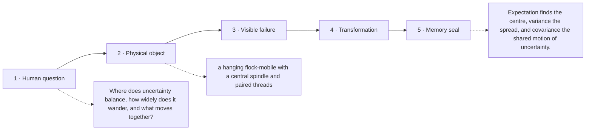

# Diagram — Excavation 218: Expectation, Variance, and Covariance — Centre, Spread, and Shared Motion

## The five-frame memory film



```text
FRAME 1 — QUESTION
Where does uncertainty balance, how widely does it wander, and what moves together?

FRAME 2 — OBJECT
a hanging flock-mobile with a central spindle and paired threads

FRAME 3 — FAILURE
Two flocks balance at the same centre, yet one is tightly gathered and the other spans the room; the mean calls them identical.

FRAME 4 — TRANSFORMATION
Mark the balance point, measure squared wingbeats away from it, then tie paired departures together to see whether they turn in concert.

FRAME 5 — SEAL
Expectation finds the centre, variance the spread, and covariance the shared motion of uncertainty.
```

## Position inside the Undercroft

```text
Realm 4 of 5 — The Observatory of Possible Worlds
possible worlds → evidence → centre and spread → settling averages → bell-shaped error → convincing claims
current root: Expectation, Variance, and Covariance
```

```text
temptation : report only the average and treat distributions sharing it as interchangeable
break      : the average hides spread. It also cannot reveal whether tiger count and alarm count rise together or move independently, which matters when one is used to predict the other.
repair     : compute expectation as a probability-weighted centre, variance as average squared departure from that centre, and covariance as average product of paired departures
```

The film can be replayed without the equation. Once it is vivid, the symbols become a compact subtitle for a scene the reader already owns.
