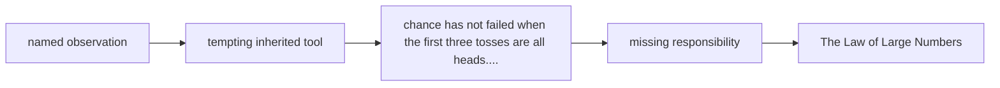

# Diagram — Excavation 219: The Law of Large Numbers — Why Averages Eventually Settle



```text
temptation : demand that every short sample reproduce the population expectation exactly
break      : chance has not failed when the first three tosses are all heads. Short runs fluctuate, so exact equality would reject honest randomness and make estimation impossible.
repair     : study the sample mean as the number of independent observations grows and ask whether the probability of a substantial error shrinks toward zero
```

The diagram is deliberately causal. Its arrows mean “this failure made the next responsibility necessary,” not merely “read this box next.”
