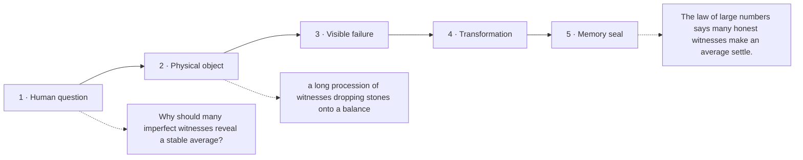

# Diagram — Excavation 219: The Law of Large Numbers — Why Averages Eventually Settle

## The five-frame memory film



```text
FRAME 1 — QUESTION
Why should many imperfect witnesses reveal a stable average?

FRAME 2 — OBJECT
a long procession of witnesses dropping stones onto a balance

FRAME 3 — FAILURE
The first witness places one stone on one side and the station declares the population average to be an extreme.

FRAME 4 — TRANSFORMATION
Let every new witness contribute one stone, but divide by the growing crowd so headcount alone cannot inflate the answer.

FRAME 5 — SEAL
The law of large numbers says many honest witnesses make an average settle.
```

## Position inside the Undercroft

```text
Realm 4 of 5 — The Observatory of Possible Worlds
possible worlds → evidence → centre and spread → settling averages → bell-shaped error → convincing claims
current root: The Law of Large Numbers
```

```text
temptation : demand that every short sample reproduce the population expectation exactly
break      : chance has not failed when the first three tosses are all heads. Short runs fluctuate, so exact equality would reject honest randomness and make estimation impossible.
repair     : study the sample mean as the number of independent observations grows and ask whether the probability of a substantial error shrinks toward zero
```

The film can be replayed without the equation. Once it is vivid, the symbols become a compact subtitle for a scene the reader already owns.
