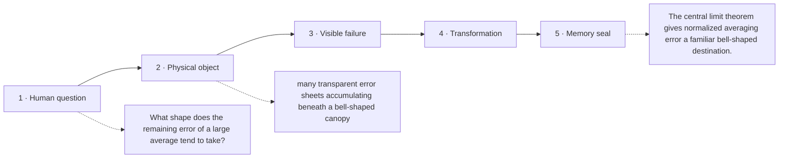

# Diagram — Excavation 220: The Central Limit Theorem — Why Bell Shapes Keep Appearing

## The five-frame memory film



```text
FRAME 1 — QUESTION
What shape does the remaining error of a large average tend to take?

FRAME 2 — OBJECT
many transparent error sheets accumulating beneath a bell-shaped canopy

FRAME 3 — FAILURE
The average is assumed to keep the strange shape of one individual disturbance, despite combining a hundred of them.

FRAME 4 — TRANSFORMATION
Repeat the entire averaging experiment, centre each error, and measure it in its natural shrinking units. The stacked silhouettes smooth toward a bell.

FRAME 5 — SEAL
The central limit theorem gives normalized averaging error a familiar bell-shaped destination.
```

## Position inside the Undercroft

```text
Realm 4 of 5 — The Observatory of Possible Worlds
possible worlds → evidence → centre and spread → settling averages → bell-shaped error → convincing claims
current root: The Central Limit Theorem
```

```text
temptation : assume the average has the same distributional shape as each individual disturbance
break      : averaging changes scale and shape. A single skewed measurement and the mean of one hundred such measurements do not have the same uncertainty.
repair     : centre the sample mean at μ, divide by its standard error σ/√n, and study the distribution of that normalized error as n grows
```

The film can be replayed without the equation. Once it is vivid, the symbols become a compact subtitle for a scene the reader already owns.
