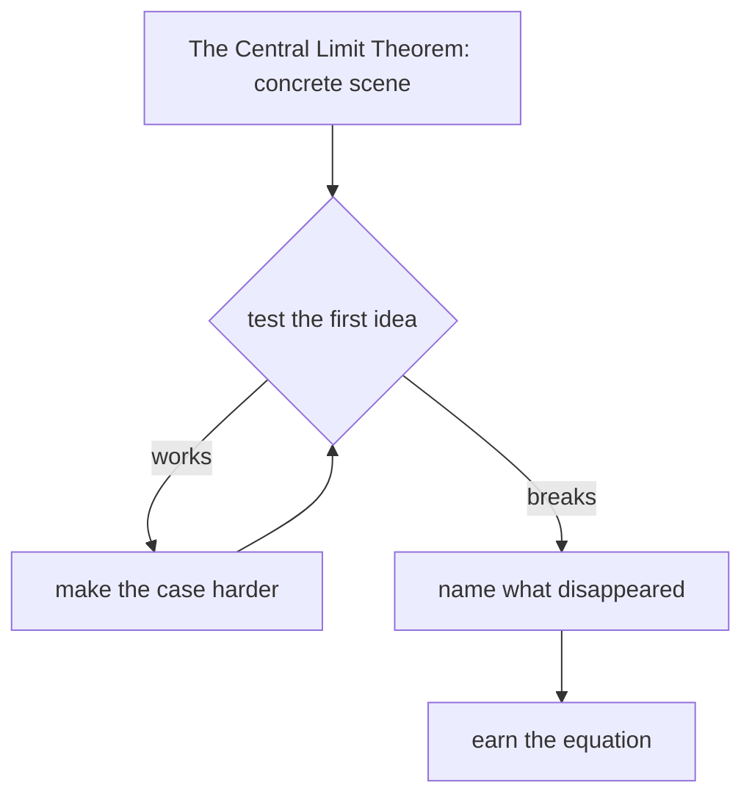

# Diagram — Excavation 220: The Central Limit Theorem — Why Bell Shapes Keep Appearing



```text
temptation : assume the average has the same distributional shape as each individual disturbance
break      : averaging changes scale and shape. A single skewed measurement and the mean of one hundred such measurements do not have the same uncertainty.
repair     : centre the sample mean at μ, divide by its standard error σ/√n, and study the distribution of that normalized error as n grows
```

The diagram is deliberately causal. Its arrows mean “this failure made the next responsibility necessary,” not merely “read this box next.”
