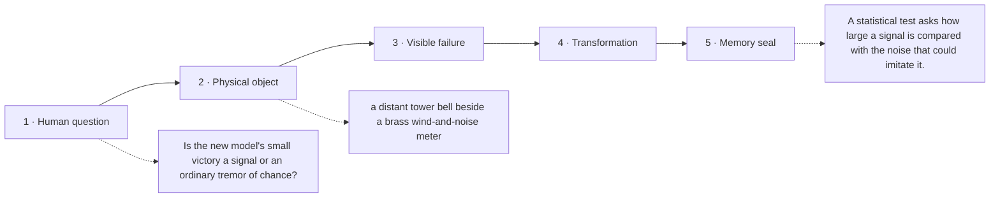

# Diagram — Excavation 221: Hypothesis Tests and Confidence Intervals — When Is an Improvement Convincing?

## The five-frame memory film



```text
FRAME 1 — QUESTION
Is the new model's small victory a signal or an ordinary tremor of chance?

FRAME 2 — OBJECT
a distant tower bell beside a brass wind-and-noise meter

FRAME 3 — FAILURE
One faint positive sound is celebrated without asking how loudly the empty night usually rattles the tower.

FRAME 4 — TRANSFORMATION
Subtract the no-improvement claim and measure the remaining sound in units of ordinary sample-mean wobble; keep an interval, not only a verdict.

FRAME 5 — SEAL
A statistical test asks how large a signal is compared with the noise that could imitate it.
```

## Position inside the Undercroft

```text
Realm 4 of 5 — The Observatory of Possible Worlds
possible worlds → evidence → centre and spread → settling averages → bell-shaped error → convincing claims
current root: Hypothesis Tests and Confidence Intervals
```

```text
temptation : declare every positive sample difference a discovery
break      : another sample from unchanged systems can land above zero by chance. A positive sign says which side won this sample; it does not say how surprising that victory would be if the true average difference were zero.
repair     : state the no-improvement claim, measure the observed mean difference in units of its standard error, and report both a test statistic and the range of effects compatible with the sampling noise
```

The film can be replayed without the equation. Once it is vivid, the symbols become a compact subtitle for a scene the reader already owns.
