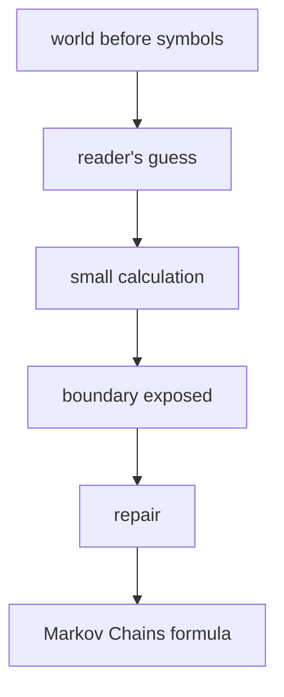

# Diagram — Excavation 222: Markov Chains — When the Present Carries the Relevant Past



```text
temptation : assign one fixed next-location distribution regardless of the current location
break      : the river makes village likely while deep forest makes river likely. Erasing the present state destroys exactly the information that changes the next step.
repair     : choose a state description rich enough that, once the present state is known, earlier history adds no further information about the next-state distribution
```

The diagram is deliberately causal. Its arrows mean “this failure made the next responsibility necessary,” not merely “read this box next.”
