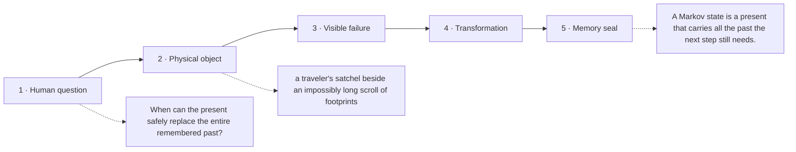

# Diagram — Excavation 222: Markov Chains — When the Present Carries the Relevant Past

## The five-frame memory film



```text
FRAME 1 — QUESTION
When can the present safely replace the entire remembered past?

FRAME 2 — OBJECT
a traveler's satchel beside an impossibly long scroll of footprints

FRAME 3 — FAILURE
The ranger drags every footprint ever made, yet the next turn only needs information that could have been packed into today's state.

FRAME 4 — TRANSFORMATION
Put location, weather, and every genuinely predictive fact into the present satchel. Test whether older footprints change tomorrow once the satchel is known.

FRAME 5 — SEAL
A Markov state is a present that carries all the past the next step still needs.
```

## Position inside the Undercroft

```text
Realm 5 of 5 — The Garden of Futures
sufficient present → remembered futures → trustworthy landscape → safe computation
current root: Markov Chains
```

```text
temptation : assign one fixed next-location distribution regardless of the current location
break      : the river makes village likely while deep forest makes river likely. Erasing the present state destroys exactly the information that changes the next step.
repair     : choose a state description rich enough that, once the present state is known, earlier history adds no further information about the next-state distribution
```

The film can be replayed without the equation. Once it is vivid, the symbols become a compact subtitle for a scene the reader already owns.
