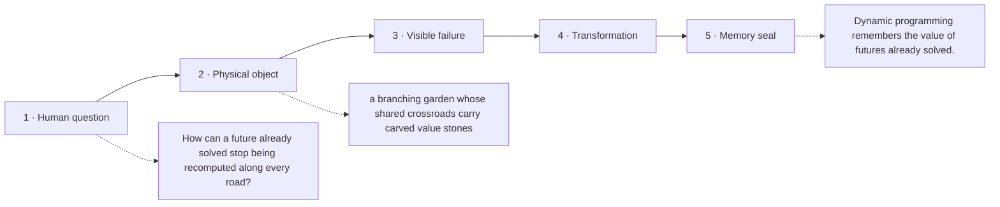

# Diagram — Excavation 223: Dynamic Programming — Remembering the Value of Futures Already Solved

## The five-frame memory film



```text
FRAME 1 — QUESTION
How can a future already solved stop being recomputed along every road?

FRAME 2 — OBJECT
a branching garden whose shared crossroads carry carved value stones

FRAME 3 — FAILURE
Every route redraws the same journey from the bridge to home, and the tree of copies swallows the garden.

FRAME 4 — TRANSFORMATION
Solve the bridge once and carve its remaining value into the stone. Every upstream path may now reuse that future.

FRAME 5 — SEAL
Dynamic programming remembers the value of futures already solved.
```

## Position inside the Undercroft

```text
Realm 5 of 5 — The Garden of Futures
sufficient present → remembered futures → trustworthy landscape → safe computation
current root: Dynamic Programming
```

```text
temptation : enumerate every possible full action sequence and total its reward independently
break      : the number of paths grows exponentially with horizon, and shared suffixes are recomputed. A ten-step tree may contain many copies of the same state with the same remaining problem.
repair     : give each state one stored value equal to the best immediate reward plus the discounted expected value of its possible next states, then reuse that value wherever the state reappears
```

The film can be replayed without the equation. Once it is vivid, the symbols become a compact subtitle for a scene the reader already owns.
