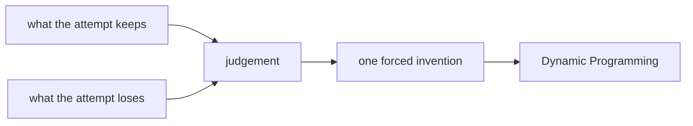

# Diagram — Excavation 223: Dynamic Programming — Remembering the Value of Futures Already Solved



```text
temptation : enumerate every possible full action sequence and total its reward independently
break      : the number of paths grows exponentially with horizon, and shared suffixes are recomputed. A ten-step tree may contain many copies of the same state with the same remaining problem.
repair     : give each state one stored value equal to the best immediate reward plus the discounted expected value of its possible next states, then reuse that value wherever the state reappears
```

The diagram is deliberately causal. Its arrows mean “this failure made the next responsibility necessary,” not merely “read this box next.”
